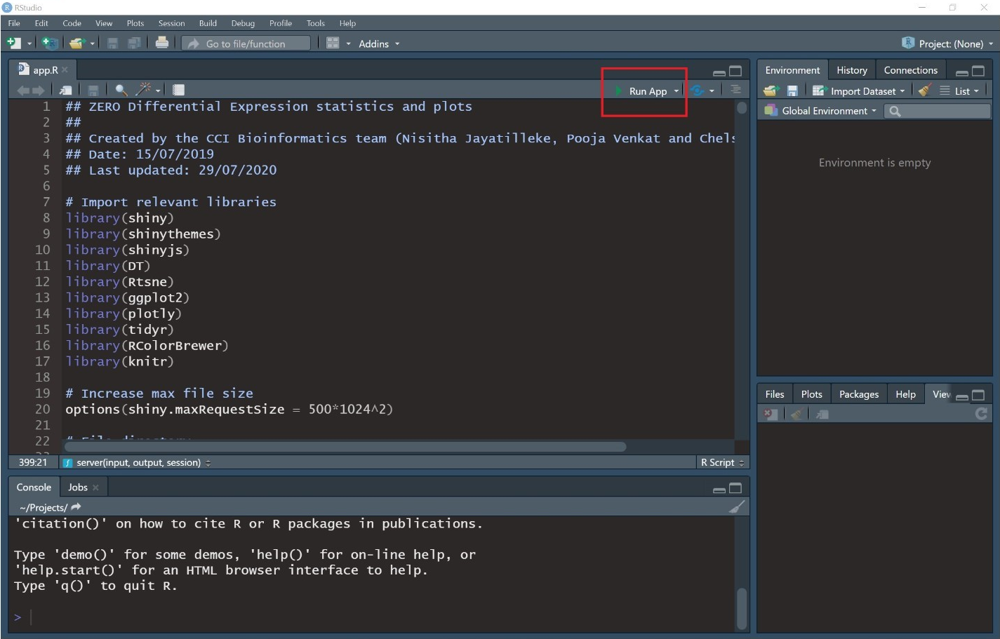
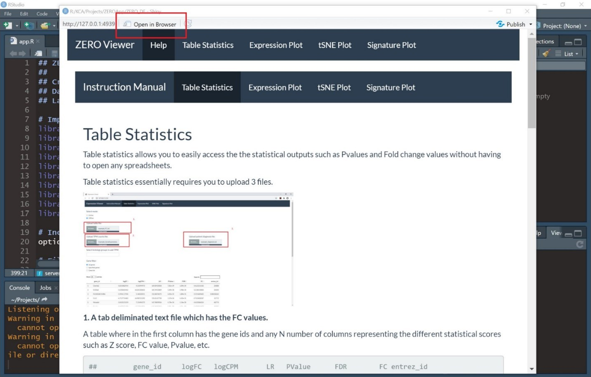

# ZERO Viewer

## Requirements 

### Standalone version

- R 4.0.x 
- Compatible web browser (eg. Chrome, Firefox, Edge)

### Additional requirements for running from source

- Rstudio
- The following R packages (available through CRAN):
  - shinythemes
  - shinyjs
  - DT
  - Rtsne
  - ggplot2
  - plotly
  - tidyr
  - RColorBrewer
  - knitr
  
## Installation and running the application

### Standalone version (windows only)

A compiled standalone executable is available in the current release section of the git. The executable has been compiled with Inno Setup (v5.6.1(a)) via the RInno package (https://github.com/ficonsulting/RInno). R version 4.0.2 is also included in the installation. 

Run the executable and follow the prompts. The installation directory will be located in your user documents folder. Once installed, the first run of the application may take several minutes as the R packages are installed. A browser window will automatically open with the application GUI when ready. Succesive runs of the application will have a much quicker startup time as the R packages will already be installed. 

### Source code (windows or mac)

The source code is available to download through the current release or the git repository. To run the application from the source you will require a working installation of R (4.0.x) (https://cran.r-project.org/bin/windows/base/) and Rstudio (https://rstudio.com/products/rstudio/download/#download) as well as the required R packages (see additional requirements for running from source). 

Once installed, open Rstudio and run the following to install the necessary packages:

```R
install.packages(c("shinythemes", "shinyjs", "DT", "Rtsne", "ggplot2", "plotly", "tidyr", "RColorBrewer", "knitr"))
```

Unzip the source code zip file in any location of your choice. If all packages have been installed correctly in the prior step, open the app.R file (found in the main directory of the source code folder) in R studio and click on the "Run App" button (see image) which will launch the Shiny application. 



Once the window pops up, click "Open in Browser". This will open a browser window/tab (default browser) with the application running. Please note that the Rstudio window (where you clicked "Open in Browser", will still be running in the background. Do not close this as this is the main process for the application (else the application will terminate). The application must be run in a browser window as the plot download functionality is only availble via browsers.



To terminate the program simply close all browser and Rstudio windows.

## Troubleshooting and common issues

**When the application opens in the browser it is greyed out**

This event indicates that there has been a crash in the shiny application script. If you come across this issue please navigate to 'Users/\<username\>/Documents/ZERO Viewer/log/' and create an issue on the git with the contents of the *error.log* file.

**The application will not open at all when I try to click on the launch icon**

Chances are there was a crash in the previous instance of the application running. If so, please check your error.log file and post the issue on the git page. Sometimes there may be an unexpected closure of the application and a instance of R for window front end will be still running in the background. Please open task manager (Ctrl + Shift + Esc) and find any instance of R for windows front end and end those tasks. Once that is done, try and re-open the application. 

**An error saying a packages version is not compatiable shows up when launching the application**

If you see this error, there may have been an signficant update in the packages. Please submit an issue on the git page and we will update the application as soon as possible. 

## Contact information

If there are any issues with the application we encourage you to post on the issues section of this github page. If you are unable to do so please get in touch with either Nisitha Jayatilleke (njayatilleke@ccia.org.au) or Pooja Venkat (pvenkat@ccia.org.au).