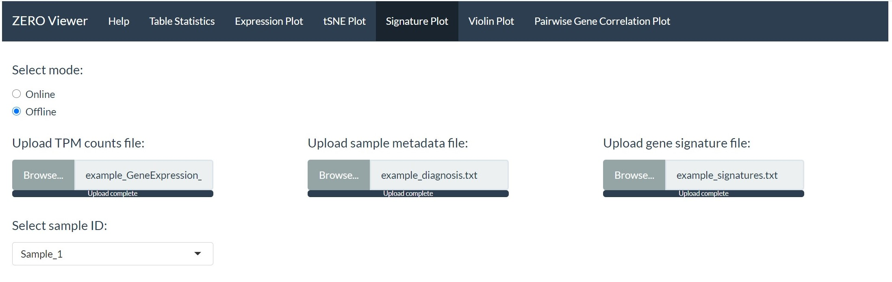
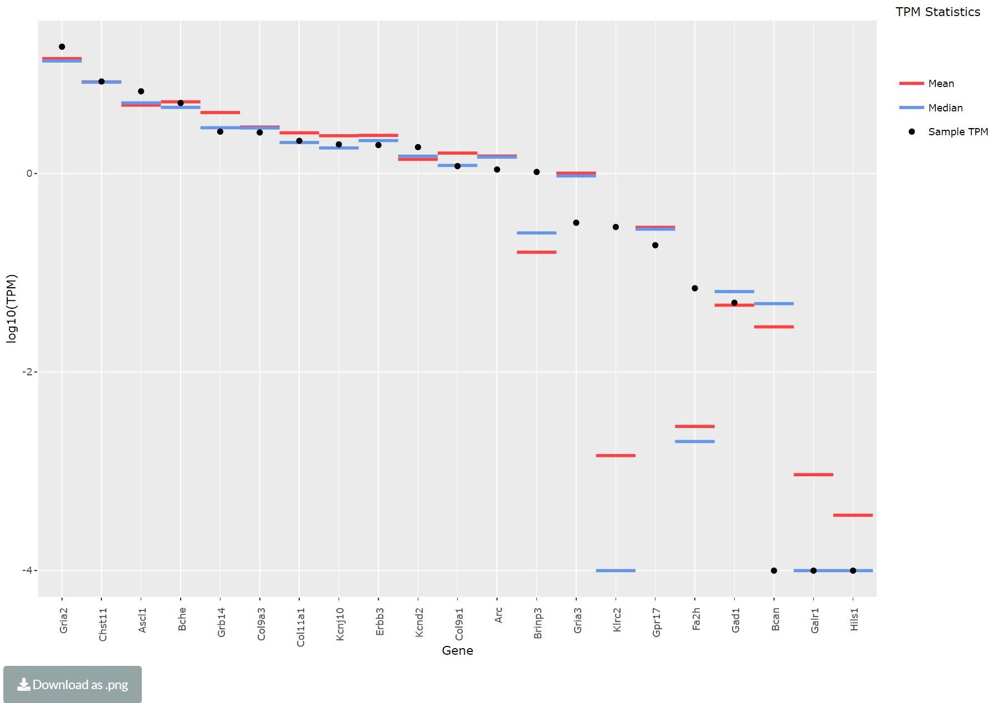

### Signature plot

The signature plot module allows the user to generate a gene signature TPM plot. This plot highlights a specific sample's TPM values for a given set of genes (signature) with comparisons against the full cohort (mean and median TPM).

The module requires the user to upload 3 files:



* **1. TPM count table.**

* **2. Sample metadata file.**

* **3. Text file containing the gene signature.** 


```
##     Gene AltGene
## 1    Arc     Arc
## 2  Ascl1   Ascl1
## 3   Bcan    Bcan
## 4   Bche    Bche
## 5 Brinp3  Brinp3
```

User defined signature files can be created similar to the one provided above. 

The specified sample to show in the gene signature TPM plot can be selected using the 'Select sample ID:' drop down list. 



The final signature plot can be downloaded using the download button located at the bottom of the page. 
