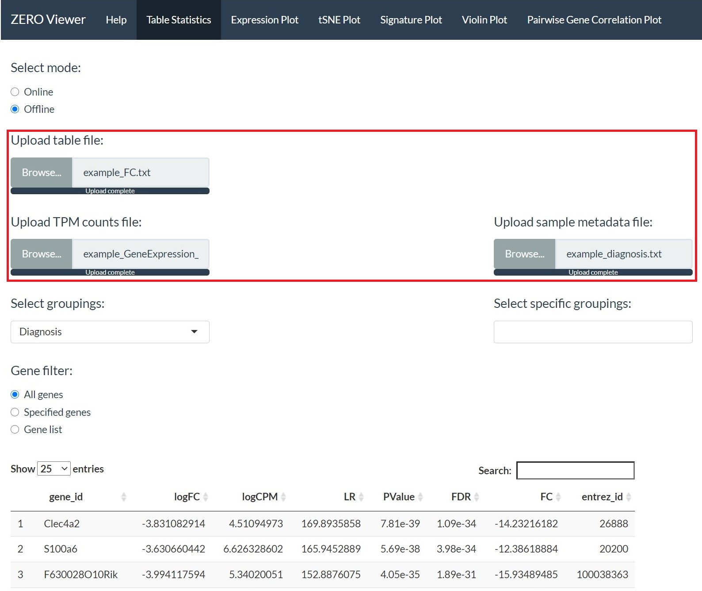
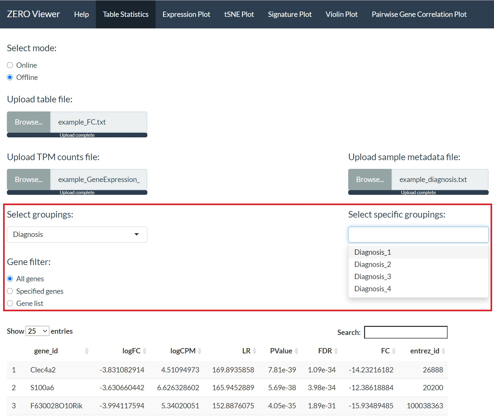
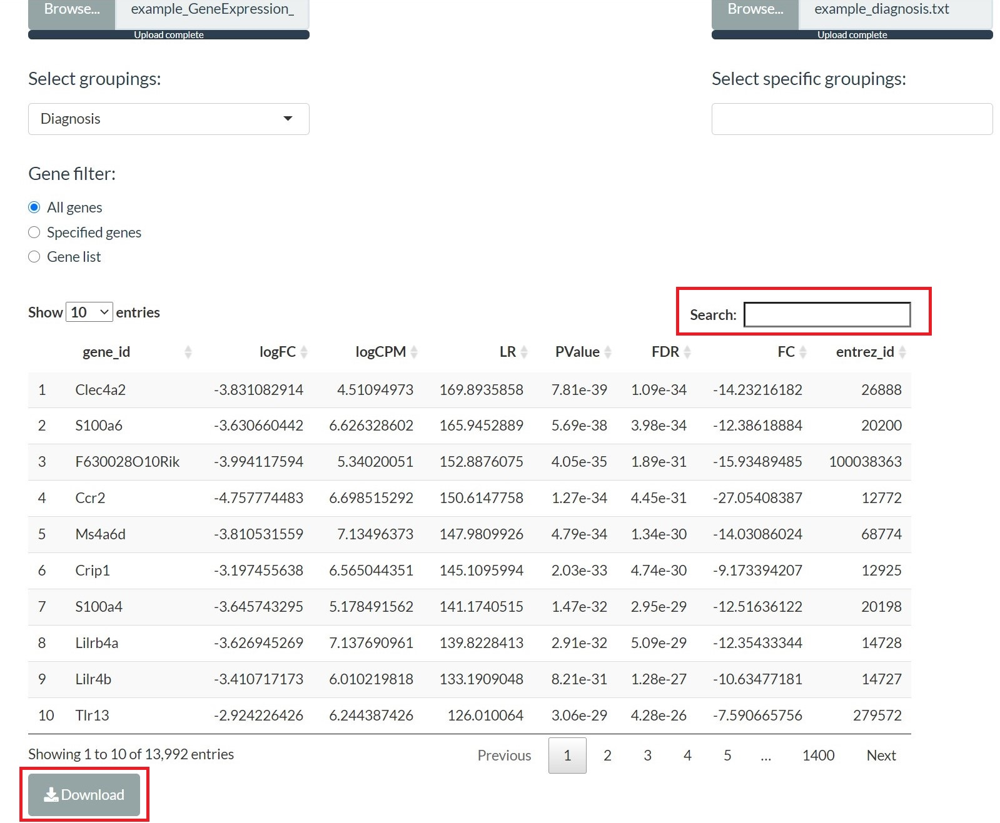

### Table statistics

The table statistics module allows the user to view and manipulate a given input table. If provided with associated TPM (transcripts per million) counts and metadata files, the user will be able to generate some additional statistics for the table based on the specified groups. 

The module requires the user to upload 3 files:



**1. A tab deliminated text file with any number of columns (first column must contain gene names).** 

A table where in the first column conatins gene names and any number of additional columns which may contain any types of information (eg. fold-change, p-values etc.).


```
##         gene_id     logFC   logCPM       LR   PValue      FDR
## 1       Clec4a2 -3.831083 4.510950 169.8936 7.81e-39 1.09e-34
## 2        S100a6 -3.630660 6.626329 165.9453 5.69e-38 3.98e-34
## 3 F630028O10Rik -3.994118 5.340201 152.8876 4.05e-35 1.89e-31
## 4          Ccr2 -4.757774 6.698515 150.6148 1.27e-34 4.45e-31
## 5        Ms4a6d -3.810532 7.134964 147.9810 4.79e-34 1.34e-30
##          FC entrez_id
## 1 -14.23216     26888
## 2 -12.38619     20200
## 3 -15.93489 100038363
## 4 -27.05408     12772
## 5 -14.03086     68774
```

**2. Transcripts per million (TPM) counts file.**

A TPM counts file which contains the TPM values for all genes and samples present in the input tab-delimited file in the first step. The first column must contain gene names. A 'transcript_id(s)' column may be present (any column with this label will be automatically removed), however, any other columns will be regarded as samples.


```
##         gene_id    transcript_id.s. Sample_1 Sample_2 Sample_3
## 1 0610005C13Rik NR_038165,NR_038166     0.17     1.26     0.00
## 2 0610007P14Rik           NM_021446    27.28    30.72    29.33
## 3 0610009B22Rik           NM_025319    44.98    52.97    51.48
## 4 0610009L18Rik           NR_038126     1.75     2.22     3.45
##   Sample_4 Sample_5
## 1     0.00     0.49
## 2    25.42    27.83
## 3    49.70    50.60
## 4     4.42     6.21
```

**3. A sample metadata file.** 

The first column of this file should contain all the sample names as they appear in the TPM counts file. Any additional columns are treated as metadata for the samples in the first column. This file must contain column names (headers). 


```
##    Patient.ID   Diagnosis   FinalDiagnosis   Category
## 1    Sample_1 Diagnosis_1 FinalDiagnosis-1 Category_2
## 2    Sample_2 Diagnosis_2 FinalDiagnosis-2 Category_1
## 3    Sample_3 Diagnosis_1 FinalDiagnosis-1 Category_1
## 4    Sample_4 Diagnosis_2 FinalDiagnosis-2 Category_2
## 5    Sample_5 Diagnosis_1 FinalDiagnosis-1 Category_1
## 6    Sample_6 Diagnosis_3 FinalDiagnosis-3 Category_3
## 7    Sample_7 Diagnosis_3 FinalDiagnosis-3 Category_2
## 8    Sample_8 Diagnosis_3 FinalDiagnosis-3 Category_3
## 9    Sample_9 Diagnosis_4 FinalDiagnosis-4 Category_3
## 10  Sample_10 Diagnosis_4 FinalDiagnosis-4 Category_3
## 11  Sample_11 Diagnosis_2 FinalDiagnosis-2 Category_2
## 12  Sample_12 Diagnosis_2 FinalDiagnosis-2 Category_1
```

**Various options provided:**

* One of the features of the table statistics module is to generate mean and median TPM statistics based on user specified groups from the sample metadata file. 

First a metadata column must be selected from the 'Select groupings:' drop down list. Once this has been selected, specific group labels and be selected in the 'Select specific groupings:' box (multiple labels can be selected). This will add a mean and median TPM for each group selected across all genes to the end of the displayed table. 

* Selecting genes 

Genes can be filtered down using the one of the folliwng options: 

  *1. all genes - displays all genes present in the file.*

  *2. Specified genes - the user can select specific genes from selection drop down menu.*

  *3. Gene list - displays genes based on an input single column text file (no header) of gene names.*



Additionally, there is a search option which can be used to perform a keyword search. Final tables can be downloaded using the download button at the bottom of the page. 




