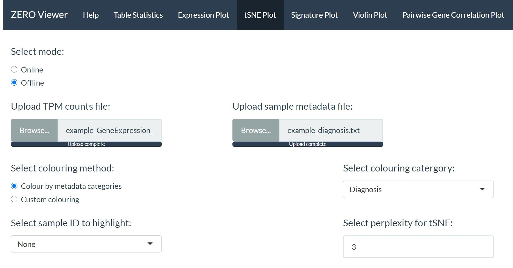
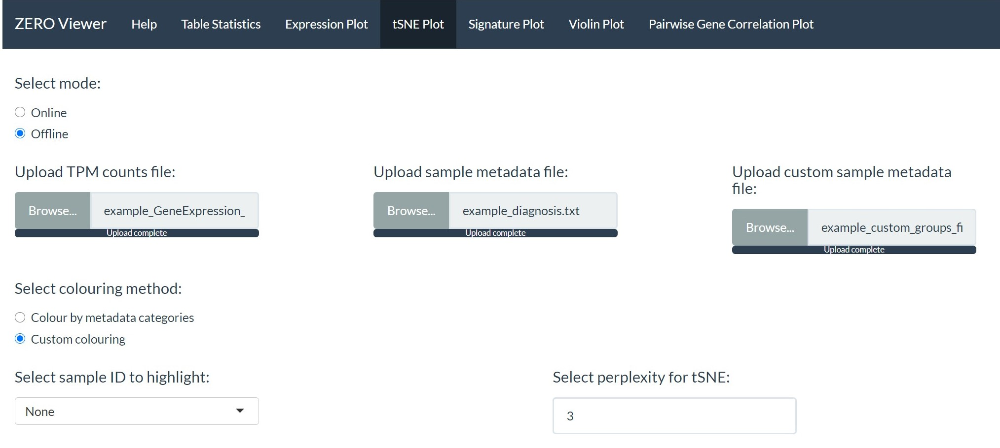
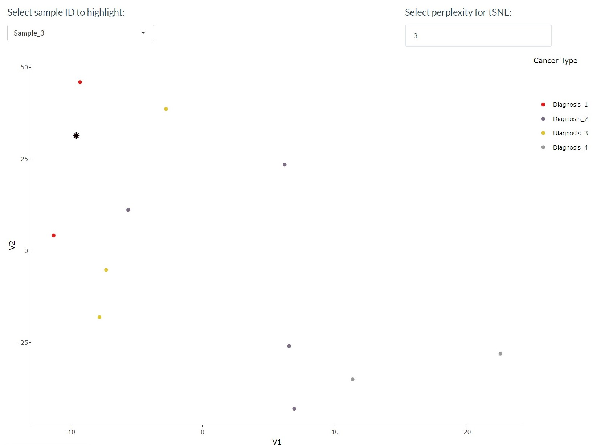
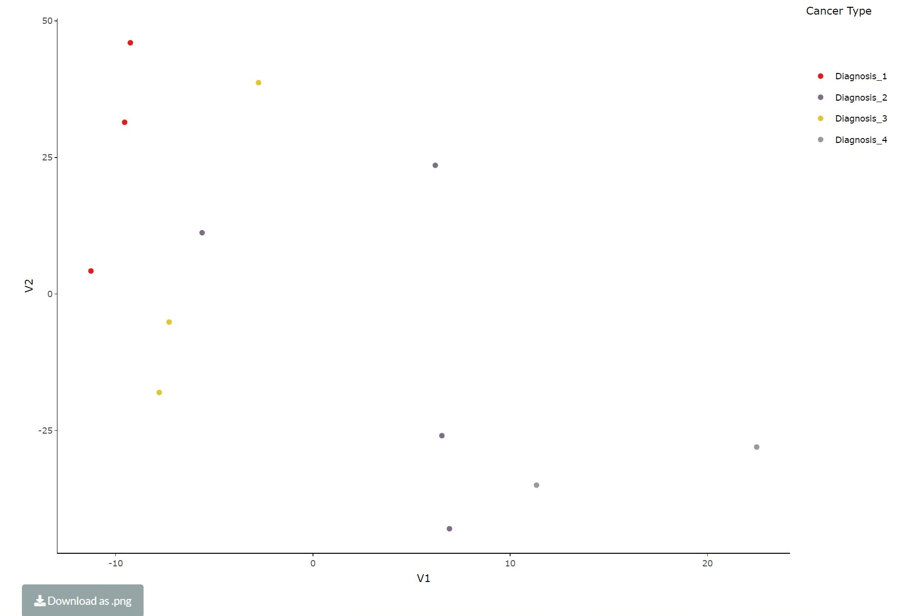

### tSNE plot

The tSNE plot module allows the user to generate a tSNE plot for all samples and subsequently colour by specified groupings. Additional metadata information can also be viewed in the interactive plot. 

The module requires the user to upload 2 files:

* **1. TPM count table.**

* **2. Sample metadata file.**

Additionally a third file can be uploaded:

* **3. Custom group file containing sample ids and the associated groups.**


```
##    Patient Group
## 1 Sample_1  TEST
## 2 Sample_6 TEST2
```

**If using the sample metadata for colouring (only TPM and sample metadata files)**

The first method of colouring the tSNE plot is to use the categories provided in your sample metadata file. Once the necessary files are uploaded (TPM and metadata), the option to colour by metadata category will be available in a drop down box. The plot will automatically select colours for the plot based on the number of groups in the selected category.



**If using a custom group file (thrid file)**

The second method of colouring the plot is by using a custom user input with sample ids and groupings. Colours will automatically be assigned in this method and any samples not provided in the file will be greyed out in the plot. 

The 'Custom user input' option under 'Select colour table input method' must be selected for this method to be used. 


 
Please be aware that the tSNE plots may take sometime to load. If it does not end up loading after few minutes, please try restarting the application. Additionally, you may need to adjust (lower) your perplexity value until the plot is generated (read below).

**Options:** 

The application allows the user to identify the where a specific sample appears in the plot by selecting the sample ID in the 'Select sample ID to highlight:' drop down menu. The selected sample ID will be highlighted with a star (see example image below).



Additionally, the user can hover over the graph to identify the sample ID and other sample metadata for each data point. 

The user also has the option to adjust the perplexity of the tSNE in the case that there are too few samples for the default value of 20, or if you wish to increase it beyond 20. 



The generated graph can be downloaded as a png file and saved locally using the download button. 

Please note that an error message will initially appear prior to loading the files. This message can be ignored (will be fixed in a future update). Any further error messages that appear will be directly related to an issue with the uploaded files or the specified perplexity of the tSNE.  
